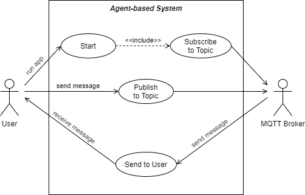

# mas-mqtt-user

## REQUIREMENTS
- When _started_, the agent-based system _subscribes_ to an MQTT topic

- The system receives messages from the user and _publishes_ them to an MQTT topic
- The system receives messages from the broker (those published to the subscribed topic) and _sends_ them to the user

## ACTIVITY DIAGRAM

## USE CASES MODELING
### Actors
- __User:__ The person who uses the system

- __MQTT Broker:__ A server that adopts the MQTT protocol to receive messages from _publishers_ and route them to the appropriate _subscribers_

### Use Cases
- __Start:__ The User runs the System

- __Subscribe to Topic:__ The System subscribes to an MQTT topic
- __Publish to Topic:__ The User sends a message and the System publishes it to an MQTT topic
- __Send to User:__ Whenever a message is published to the subscribed topic, the System receives that message from the MQTT Broker and sends it to the User

### Use-case Diagram

